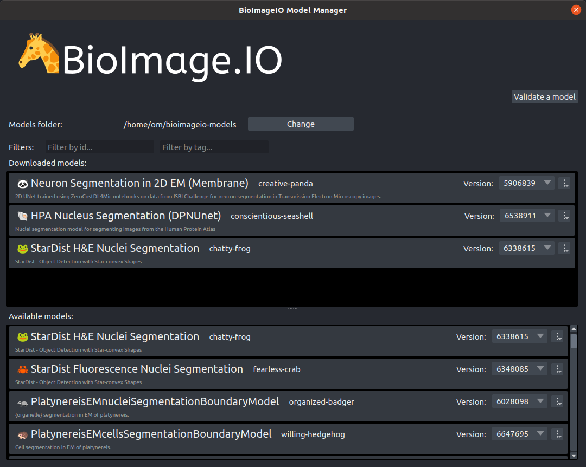

# napari-bioimageio

napari plugin for managing AI models in the [BioImage Model Zoo](https://bioimage.io).

> **WARNING**: This is an alpha release. The API may change in future versions, and please feel free to create issues to report bugs or provide feedbacks.



## Installation

```
pip install napari-bioimageio
```

(If you don't have napari installed, run `pip install napari[pyqt5]`)

## Usage

This library is meant for helping developers to ease the handling of models in napari.

We provide a set of API functions for managing and selecting models.
### `show_model_manager()`
Show the model manager with a model list pulled from the BioImage Model Zoo, the user can explore all the available models, download or remove models. 

The model manager also offers the possibility to test the compliance of a local module in your machine: use the "Validate a model" button, select a model file in your local drive and a validation report will appear with the results.

### `show_model_selector(filter_id=None, filter_tag=None)`
Display a dialog for selecting models from the BioImage Model Zoo, the user can either select an existing model or download from the BioImage Model Zoo.

The selected model information (a dictionary) will be returned if the user selected a model, otherwise it returns `None`.

Once the user selected the model, you can access the name, and also the file path to the model resource description file (via the `rdf_source` key). With the `bioimageio.core` library (installed via `pip install bioimageio.core` or `conda install -c conda-forge bioimageio.core`), you can run inference directly, the following examples shows how to implement it:

```python
# Popup a model selection dialog for choosing the model
model_info = show_model_selector(filter_id=None, filter_tag=None)

if model_info:
  self.nucseg_model_source = model_info["rdf_source"]
  # Load model 
  model_description = bioimageio.core.load_resource_description(model_info["rdf_source"])
  input_image = imageio.imread("./my-image.tif")

  with bioimageio.core.create_prediction_pipeline(
      bioimageio_model=model_description
  ) as pipeline:
    output_image = bioimageio.core.prediction.predict_with_padding(
        pipeline, input_image, padding=padding
    )
```
Note: To run the models, you need to setup the conda environment properly according to the [installation guide of bioimageio.core](https://github.com/bioimage-io/core-bioimage-io-python#installation).

For more examples, see [this example notebook](https://github.com/bioimage-io/core-bioimage-io-python/blob/main/example/bioimageio-core-usage.ipynb) for `bioimageio.core`.

You can also access the weight files directly by searching the model folder (e.g. extract the model folder path via `os.path.dirname(model_description["rdf_source"])`), this will be useful if you prefer to use your own model inference logic.
### `show_model_uploader()`
Display a dialog to instruct the user to upload a model package to the BioImage Model Zoo.
Currently, it only shows a message, in the future, we will try to support direct uploading with user's credentials obtained from Zenodo (a public data repository used by the BioImage Model Zoo to store models).

To create a BioImageIO-compatible model package, you can use the `build_model` function as demonstrated in [this notebook]((https://github.com/bioimage-io/core-bioimage-io-python/blob/main/example/bioimageio-core-usage.ipynb)).


## Example plugins

You can find example napari plugins in the [examples folder](https://github.com/bioimage-io/napari-bioimageio/tree/main/examples).

## Testing

When developing napari plugins using napari-bioimageio, it is important to setup the tests in order to make sure your plugin and models will work during the development cycles.

To facilitate the creation of tests with napari plugins that produce or consume bioimage.io-compatible models, we provide the command line tools and api functions to help you validate the test run the models.

With `bioimageio.core` (installed via `pip install bioimageio.core`), you can use the command line to test a model produced from your napari plugin:
```
bioimageio test-model <MODEL>
```
This command will load the test data provided by the model, run it to produce the output and compare it against the provided outputs, if not matched, an error will be thrown. For other command line options, please refer to [here](https://github.com/bioimage-io/core-bioimage-io-python#command-line).

For more flexible testing of the models and plugins, you can use the inference api provided by the `bioimageio.core`, see [this notebook](https://github.com/bioimage-io/core-bioimage-io-python/blob/main/example/bioimageio-core-usage.ipynb) for more examples.

Alternatively, you can also use the pure model spec validator to perform static check for the model package, this can be done via the [`bioimageio.spec`](https://github.com/bioimage-io/spec-bioimage-io#bioimageiospec-python-package) module (installed via `pip install bioimageio.spec`). Note that this will only allow partial validation for the file itself, it does not provide guarantee for the model itself.

## Contribution guidelines
Please the the [issue tracker](https://github.com/bioimage-io/napari-bioimageio/issues) to report bugs or propose new features, if you are a developer, feel free to send us pull requests via Github.

Learn how to build napari plugins, see the [napari plugin documentation](https://napari.org/stable/plugins/index.html#how-to-build-plugins).

To contribute models to the bioimage model zoo, see [here](https://bioimage.io/docs/#/contribute_models/README).

## Development

- Install and set up development environment.

  ```sh
  pip install -r requirements_dev.txt
  ```

  This will install all requirements.
It will also install this package in development mode, so that code changes are applied immediately without reinstall necessary.

- Here's a list of development tools we use.
  - [black](https://pypi.org/project/black/)
  - [flake8](https://pypi.org/project/flake8/)
  - [mypy](https://pypi.org/project/mypy/)
  - [pydocstyle](https://pypi.org/project/pydocstyle/)
  - [pylint](https://pypi.org/project/pylint/)
  - [pytest](https://pypi.org/project/pytest/)
  - [tox](https://pypi.org/project/tox/)
- It's recommended to use the corresponding code formatter and linters also in your code editor to get instant feedback. A popular editor that can do this is [`vscode`](https://code.visualstudio.com/).
- Run all tests, check formatting and linting.

  ```sh
  tox
  ```

- Run a single tox environment.

  ```sh
  tox -e lint
  ```

- Reinstall all tox environments.

  ```sh
  tox -r
  ```

- Run pytest and all tests.

  ```sh
  pytest
  ```

- Run pytest and calculate coverage for the package.

  ```sh
  pytest --cov-report term-missing --cov=napari-bioimageio
  ```

- Continuous integration is by default supported via [GitHub actions](https://help.github.com/en/actions). GitHub actions is free for public repositories and comes with 2000 free Ubuntu build minutes per month for private repositories.
